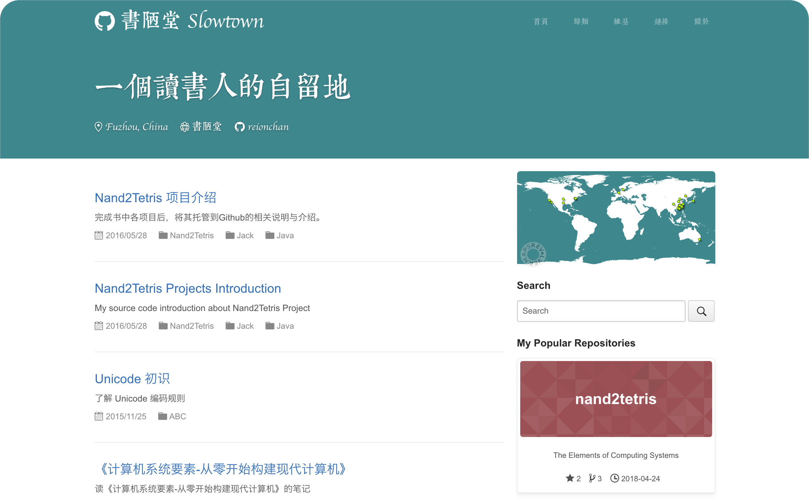

# 書陋堂

我的个人博客：<https://reionchan.github.io>

<center>
    <a href="https://reionchan.github.io"></a>
</center>
  

## 概览
<!-- vim-markdown-toc GFM -->
* [字体说明](#字体说明)
* [关于模板说明](#关于模板说明)
* [贴心提示](#贴心提示)
* [经验与思考](#经验与思考)
* [致谢](#致谢)

<!-- vim-markdown-toc -->

## 字体说明

本博客标题、子标题、文章标题、导航等多处精心选择了两款优美的字体，现说明如下：  

* 英文字体： **Apple Chancery**  
该款字体为 Mac 系统自带字体
  
* 中文字体： [**文悦古典明朝体**](http://wytype.com/typeface/WenYue-GuDianMingChaoTi)  
此款字体为文悦科技字体产品提供「非商业使用」版免费下载，点击上面的字体名即可下载。咨询过字体作者，如果商用请到官网申请授权哦。在此由衷感谢文悦字库给我们带来的优美字体。  
  
当然，你也可以 DIY 自己的字体，只需修改如下处的代码：
1. assets/css/pages/index.css

```
.home .banner .collection-head,
.home .site-header h1 a,
.home .site-header .site-header-nav-item,
.home .collection-head .collection-header {
    /* 此处修改成钟意的字体 */
    font-family: "Apple Chancery", "WenYue-GuDianMingChaoTi-NC-W5";
}
```
2. assets/css/posts/index.css

```
.slowtown {
    /* 此处修改成钟意的字体 */
    font-family: "Apple Chancery", "WenYue-GuDianMingChaoTi-NC-W5";
}
```

## 关于模板说明

本模板是基于 [码志](http://mazhuang.org/) 修改，下面二小节是原作者的提示与经验分享。  
字里行间能感受原作者的良苦用心，受教的同时不忍删去，留于此处时常温习之。  
欢迎喜欢本模板的各位进行 fork 操作，**麻烦注意以下几点：**  
  
* 请删除模板中涉及本人信息及创作文章等内容
* 鄙人欢迎各位遵照博文指示的相关协议规定进行转载分享
* 如果有不清楚的地方，请联系：reion78@gmail.com


## 贴心提示

1. 排版建议遵照一定的规范，推荐 [中文文案排版指北（简体中文版）][1]。

2. 在本地预览博客效果可以参考 [Setting up your Pages site locally with Jekyll][2]。

## 经验与思考

* 简约，尽量每个页面都不展示多余的内容。

* 有时一图抵千言，有时可能只会拖慢网页加载速度。

* 言之有物，不做无痛之呻吟。

* 如果写技术文章，那先将技术原理完全理清了再开始写，一边摸索技术一边组织文章效率较低。

* 杜绝难断句、难理解的长句子，如果不能将其拆分成几个简洁的短句，说明脑中的理解并不清晰。

* 可以学习一下那些高质量的博主，他们的行文，内容组织方式，有什么值得借鉴的地方。

## 致谢

本博客外观基于 [码志](http://mazhuang.org/) 修改，感谢！

[1]: https://github.com/mzlogin/chinese-copywriting-guidelines
[2]: https://help.github.com/articles/setting-up-your-pages-site-locally-with-jekyll/
